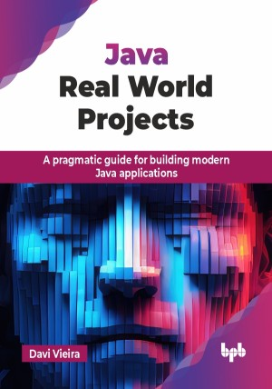

# Java Real World Projects

A pragmatic guide for building modern Java applications.

This is the repository for [Java Real World Projects
](https://bpbonline.com/products/java-real-world-projects?variant=44310813769928),published by BPB Publications.

## About the Book
Java continues to be a key technology for building powerful applications in today’s fast-changing tech world. This book helps you connect theory with practice, teaching you the skills to create real-world Java projects. With a clear learning path, you will learn the tools and techniques needed to tackle complex software development challenges with confidence.

This book, inspired by real-world Java projects, starts with Java fundamentals, covering core APIs, modern features, database handling, and automated testing. It explores frameworks like Spring Boot, Quarkus, and Jakarta EE for enterprise cloud-native applications. Employ container technologies like Docker and Kubernetes for scalable deployments. To tackle production challenges, the book will look deeply into monitoring and observability, helping developers understand application performance under unexpected conditions. It concludes with maintainability issues, introducing architectural concepts like domain-driven design (DDD), layered architecture, and hexagonal architecture, offering a roadmap for creating scalable and maintainable Java applications.

By the end of this book, you will feel confident as a Java developer, ready to handle real-world challenges and work on modern software projects. You will have a strong understanding of Java basics, modern tools, and best practices, preparing you for a successful career in Java development.

## What You Will Learn
• Efficient application of core Java API capabilities.

• Modern Java development with features like virtual threads, sealed classes, and records.

• Understanding of the Spring Boot, Quarkus, and Jakarta EE frameworks.

• Monitoring and observability with Prometheus, Grafana, and Elasticsearch.

• Using DDD, layered architecture, and hexagonal architecture to improve maintainability.
